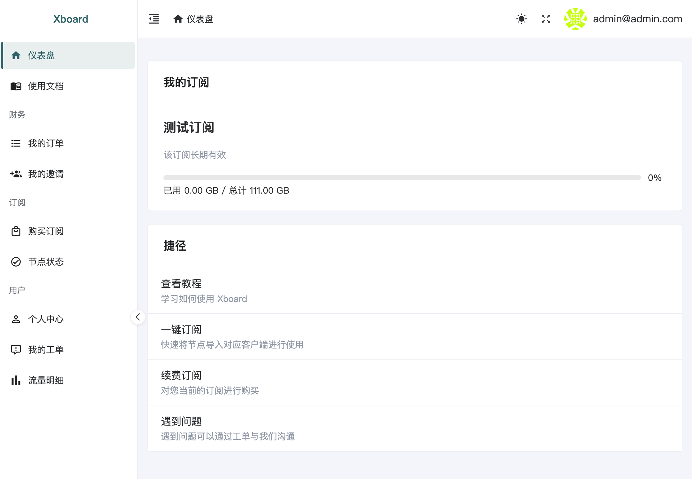

# 关于Xboard
Xboard是基于V2board二次开发，在性能上和功能上都有大部分增强的**面板

# 免责声明
本项目只是本人个人学习开发并维护，本人不保证任何可用性，也不对使用本软件造成的任何后果负责。

# Xboard 特点 
基于V2board 二次开发，增加了以下特性
- 升级Laravel10
- 适配Laravels  （提升至10+倍并发）
- 适配Webman    （比laravels快50%左右）
- 修改配置从数据库中获取
- 支持Docker部署、分布式部署
- 支持根据用户IP归属地来下发订阅
- 增加Hy2支持
- 增加sing-box下发
- 支持直接从cloudflare获取访问者真实IP
- 支持根据客户端版本自动下发新协议
- 支持线路筛选（订阅地址后面增加 &filter=香港｜美国）
- 支持Sqlite安装（代替Mysql，自用用户福音）
- 使用Vue3 + TypeScript + NaiveUI + Unocss + Pinia重构用户前端
- 修复大量BUG

# **系统架构**

- PHP8.1+
- Composer
- MySQL5.7+
- Redis
- Laravel

## 性能对比 [查看详情](./docs/性能对比.md)
> xboard 无论前端还是后端性能都有巨大的提升

|场景      | php-fpm(传统) | php-fpm(传统开启opcache) | laravels | webman(docker)|
|----     |   ----   |----   |----| ---|
|首页      | 6请求/秒      | 157请求/秒        |   477请求/秒    | 803请求/秒   |
|用户订阅   | 6请求/秒      | 196请求/秒         | 586请求/秒    | 1064请求/秒  |
|用户首页延迟| 308ms        |  110ms           |  101ms   |    98ms      |

## 页面展示


## 安装 / 更新 / 回滚
你可以点击查看下列方式的**安装、更新**步骤
- [1panel 部署](./docs/1panel安装指南.md)
- [Docker Compose 纯命令行快速部署](./docs/docker-compose安装指南.md)
- [aapanel + Docker Compose (推荐)](./docs/aapanel+docker安装指南.md)
- [aapanel 部署](./docs/aapanel安装指南.md)
### 从其他版本迁移
#### 数据库迁移
**根据你的版本查看对应的迁移指南进行迁移**
- v2board dev 23/10/27的版本  [点击跳转迁移指南](./docs/v2b_dev迁移指南.md)
- v2board 1.7.4  [点击跳转迁移指南](./docs/v2b_1.7.4迁移指南.md)
- v2board 1.7.3  [点击跳转迁移指南](./docs/v2b_1.7.3迁移指南.md)
- v2board wyx2685  [点击跳转迁移指南](./docs/v2b_wyx2685迁移指南.md)


### 注意
> 修改后台路径需要重启才能生效
```
docker compose restart
```
> 如果是是aapanel安装则需要重启 webman守护进程
